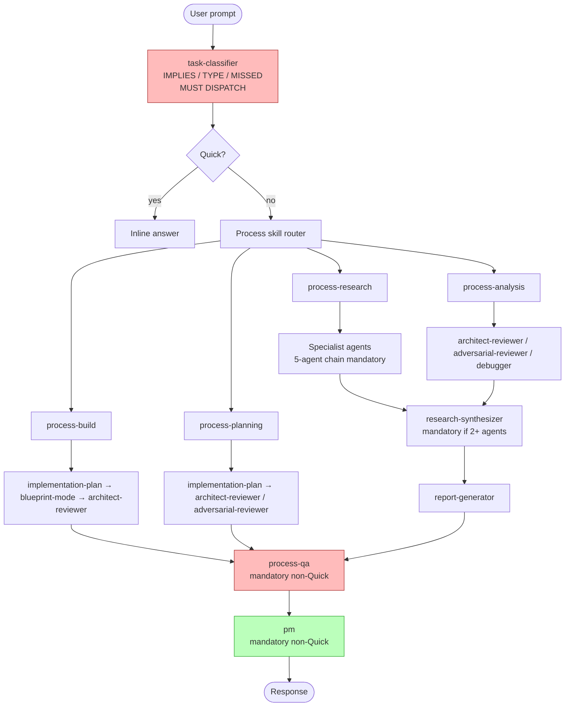
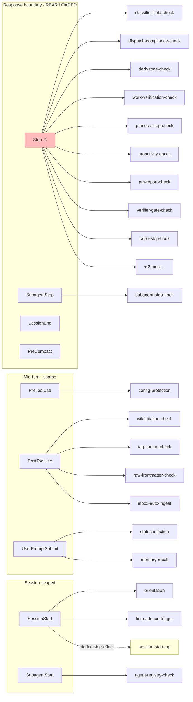
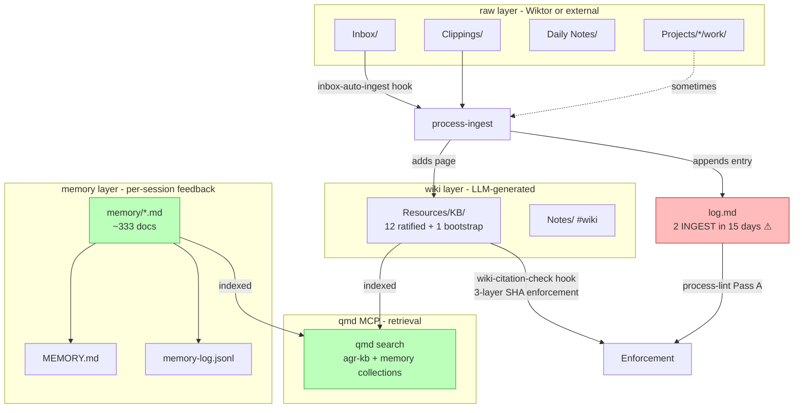
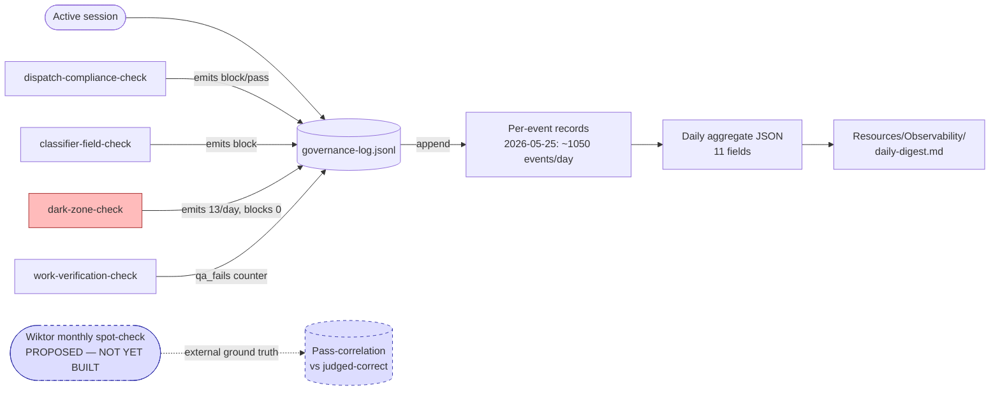
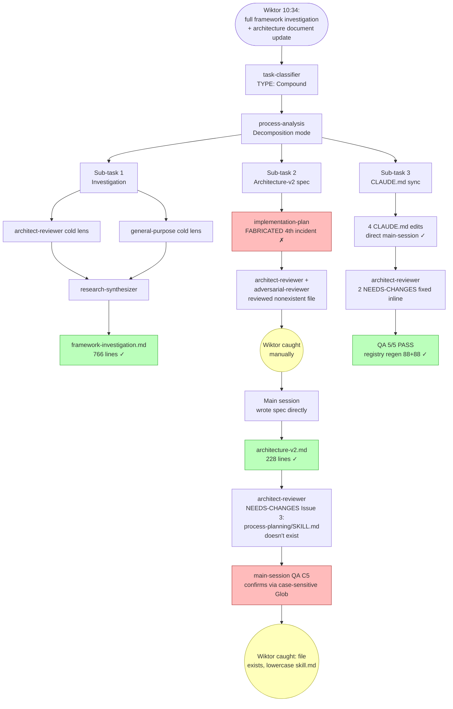

> Adapted from internal research workspace. Cross-references to vault-internal artifacts have been stripped or genericized.

# Framework Evaluation — Final

The architectural verdict of the agent-governance framework as it stands 2026-05-25, with process diagrams + cross-lens analysis. Triggered by a directive to *"evaluate the framework, does it work as intended? are there any gaps? create some diagrams of the processess we have established and analyze them."*

## Headline verdicts

| Lens | Verdict | Confidence |
|---|---|---|
| Architect (implementation alignment) | **DIVERGENT_AND_DEEP** | high |
| Adversarial (framing soundness) | **STRUCTURALLY FLAWED at the measurement layer** | 0.85 |
| Synthesis (unified) | **Architecturally salvageable via deltas + external calibration; closed-loop problem unsolvable from inside** | 0.88 |

The two lenses agree: implementation gaps are real AND framing is unsound. The architecture-v2 7-delta spec addresses internal consistency correctly but cannot resolve the closed-loop validation problem. The single highest-leverage change — and the only one that crosses the loop boundary — is an **external calibration protocol** (monthly 20-30 minute Wiktor spot-check of QA PASS artifacts against actual correctness judgment).

## The closed-loop diagnosis (the headline finding)

The adversarial lens's most-cited insight, accepted by the synthesis as load-bearing:

> *The framework measures compliance with its own rules via hooks written by the same system. The correlation between governance-log QA PASS and output correctness has never been measured. `qa_fails: 0` on sampled dates during which documented fabrications occurred.*

Stated plainly: the framework is internally consistent, externally untested. Every metric the framework produces describes conformance to its own rules. Architecture-v2's 7 deltas improve internal consistency. None measure whether internal consistency correlates with output quality.

Today's session itself is the most concentrated demonstration: 4 incidents (implementation-plan fabrication, case-sensitive Glob false-negative propagation, CMDB miscount, schema drift) all occurred during compliant flows. Every one was caught by Wiktor manually, not by the framework. Daily aggregate `qa_fails: 0` on dates spanning the fabrication window.

This is the central finding the diagrams below visualize. The processes look clean on the page; their compliance signals look healthy; the actual reliability ceiling sits at "Wiktor catches it."

---

## Diagram 1 — The canonical task flow

The shape every non-Quick task takes from prompt to response:

**What works:** task-classifier produces structural anchors that downstream hooks can verify. PM mandatory dispatch is the only floor rule that PM-format-compliance metric tracks (rising trend, 54%→61% over 7 days per investigation §F.5).

**What's broken:** the classifier verifies field PRESENCE, not field CORRECTNESS. 47 blocks vs. 42 classifications in 7 days indicates the syntactic gate is doing work — but no audit has ever measured whether the TYPE selected matches what an external judge would call right. The mandatory 5-agent research chain runs equally for "summarize this article" and "investigate 10 sub-questions" — no escape hatch for low-complexity research.

**The fabrication failure mode bypasses this entire diagram.** When implementation-plan returns fabricated tool output, every box in the chain succeeds: the dispatch happened, the QA report wrote a PASS, the PM checkpoint logged a viability verdict. The diagram drew a clean flow; the file never hit disk.

---

## Diagram 2 — Hook event coverage

The 9 hook events + what fires at each, with the Stop-chain overload visualized:

**What works:** PostToolUse hooks catch tool-call-time violations cheaply (wiki-citation-check + tag-variant-check are firing as I write this doc). PreToolUse config-protection blocks unauthorized writes to MEMORY.md and similar load-bearing files.

**What's broken:** **Stop carries 11 hooks; PostToolUse carries 5.** Every other event carries 1-3. The enforcement model is response-boundary-heavy: a session can run non-compliant for many turns before being stopped. Architecture-v2 Delta-2 names this; the spec defers the rebalance decision to per-hook compatibility reading.

**Hidden dependency (yellow):** `session-start-log.py` is not registered in either settings file. It emits via `session-start-orientation.py`'s side-effect call. If orientation fails, governance-log loses session boundary markers silently. Architecture-v2 Delta-3 addresses this.

**Architecture-v2 proposes a 12th Stop hook (Delta-5 Tier A reframed as PostToolUse).** Adversarial counter: adding enforcement to a chain whose existing 11 hooks didn't catch any of the 4 fabrications doesn't fix the trust problem — it amplifies it. None of the 5 highest-severity incidents this session are routing-table violations.

---

## Diagram 3 — Memory + wiki + qmd layer

How knowledge accumulates across sessions:

**What works:** memory layer is doing the heavy lifting — 333 docs, qmd MCP working (verified in QA earlier), feedback memos accumulate per-session corrections, MEMORY.md index loaded at session start. This is the framework's REAL learning loop.

**What's broken:** **wiki layer overhead exceeds protected content by ~3 orders of magnitude.** 3 enforcement layers (skill SHA gate + PostToolUse SHA check + lint Pass A) protect a corpus that grew by 1 page in 15 days. 11 of 12 "ratified" wiki entries are MOCs — promoted by definitional move, not synthesis. The wiki-citation-check fires on every MOC write triggering SHA recomputation for citations MOCs were never designed to have.

**Adversarial REVISE:** the architecture is sound for high-volume research workflows. At current input velocity, a two-tier enforcement (strict SHA for synthesis pages, link-only for MOCs) would right-size the investment. Architecture-v2 Delta-4 addresses the cadence framing (input-driven) but not the MOC-SHA mismatch.

---

## Diagram 4 — Compliance + observability spine

The chain that measures the framework's health (and the closed-loop problem made literal):

**What works:** governance-log appends every event with high fidelity (~1050 events/day). Daily aggregates roll up. Trends are computable (DC pass rate movement, PM format compliance trend).

**What's broken — the closed loop made visible:**

- `qa_fails: 0` in daily aggregates on dates when documented fabrications were occurring. The fabricating-QA-agent-returns-PASS path is not detected.
- `dark-zone-check.py` fires ~13 times/day, blocks 0. **94 dark-zone events in 7 days — pure logging, never automated action.** Monitoring has substituted for closing the loop.
- PM format compliance numerator covers only 58% of actual PM dispatches; the 7pp improvement headline is on a partial denominator.
- **There is no external calibration point** — no measurement of whether "QA PASS" correlates with "Wiktor judges output correct."

The dotted blue boxes show the missing link: until Wiktor's monthly spot-check exists, every compliance metric is self-referential.

---

## Diagram 5 — The Compound-decomposition flow we used today

The pattern this very session demonstrated (and where it broke):

**What this diagram says about the framework:** the cold-context dispatch + parallel-lens pattern (top branch, Sub-task 1) WORKS — it produced a 766-line investigation that survived all subsequent review. The implementation-plan-for-spec-authorship pattern (middle branch, Sub-task 2 first attempt) FAILED — fabricated 285-line output, both reviewers reviewed nonexistent file. The framework did not detect either failure; Wiktor did, twice in the same session.

This is the empirical falsification of CRITICAL RULE: Delegation in its strongest form. The rule says "NEVER produce analysis inline when a specialist exists." The data says: for spec authorship, the specialist fabricates at high enough frequency that inline main-session authoring is more reliable, not less.

---

## Per-rubric synthesis

**R1 Stated intent vs observed behavior:** DIVERGENT_AND_DEEP. CLAUDE.md states "Process enforced, not suggested" (Working Philosophy §2). Runtime enforces process MOSTLY at response boundary (Stop chain), AFTER violations have occurred. Six of ten CRITICAL RULEs have no runtime enforcement. Investigation §B documents this precisely.

**R2 Forcing-functions audit:** Mixed. classifier-field-check + dispatch-compliance-check + pm-report-check are real forcing functions on syntactic conformance. Six rules are prose-only with no enforcement (No Unsolicited Changes, Iterative Working Mindset, parts of Delegation, Quality Verification non-QA aspects, Task Plan Sync, Feature Branches for Wide Changes). The trust model for these is: prose mention + memory recall at session start → behavioral compliance. Architecture-v2 Delta-5 Tier A adds one more forcing function (routing-table validation). It does not close any of the 6 prose-only gaps.

**R3 Self-observability:** Score 0.5/5. None of the 5 known drift items (CMDB miscount, Stop overload, session-start hidden dep, wiki inert, DC schema drift) were caught by the daily-aggregate/governance-log/dark-zone pipeline before the one-off audit. The observability spine produces high-fidelity logs that nobody reads automatically. Architecture-v2 Delta-5 Tier B adds a weekly lint pass — same advisory pattern that already exists.

**R4 Reliability ceiling:** Compounding. 4 fabrication/propagation incidents in 2 weeks from the same agent (implementation-plan + the agents that reviewed its output) suggests the trust model assumption — delegate to specialist → output is more reliable than inline — is empirically false for at least one specialist class. The framework's response is to add another memo + another hookify rule + another verification step. No structural change to the trust contract.

**R5 Cost vs value:** Unmeasured. Per-non-Quick task overhead is ~5 agent dispatches + ~11 hook firings + classifier ceremony + QA REPORT + PM CHECKPOINT REPORT. Value is unmeasured against any external standard. The framework is BUYING dispatch-compliance with token cost; whether dispatch-compliance correlates with output quality is the open question only Wiktor's spot-check can answer.

**R6 Architecture-v2 closes the gaps:** Partially. Of the 7 deltas: 3 close real drift items (Delta-1 binding gaps, Delta-3 hidden dependency, Delta-7 deprecated routing). 1 improves measurement (Delta-6 schema dual-emit) but not validity (still self-referential). 1 adds enforcement (Delta-5 Tier A) that doesn't address the fabrication failure mode. 1 reframes cadence (Delta-4) without resolving the wiki-overhead-vs-content mismatch. 1 defers structural decision (Delta-2 Stop rebalance). **The architecture-v2 set is internally coherent and individually correct, but it does not contain the file-existence check (Action 1.1) that would have caught all 4 fabrication incidents.**

---

## Recommended actions — sequenced

From synthesis §5, the action list combining architect findings, adversarial structural change, and cross-lens additions:

### Action 0.1 — External calibration protocol (THE ONE STRUCTURAL CHANGE)
- **What:** monthly 20-30 min Wiktor spot-check of 5-10 randomly-selected QA PASS artifacts
- **Output:** per-artifact judgment "Does this accurately represent what it claims?" → correlation log between governance-log PASS and judged-correct
- **Why:** the ONLY action that crosses the closed-loop boundary; produces external ground truth no hook can generate from inside
- **Cost:** 20-30 min/month of Wiktor's time, recurring
- **Reversibility:** trivial; can stop at any time

### Action 1.1 — File-existence check in work-verification-check.py (NEW — not in 7-delta spec)
- **What:** PostToolUse hook on Stop event: if response claims a file was written, verify the file exists on disk
- **Why:** Would have caught the 4th implementation-plan fabrication incident at the hook level instead of requiring Wiktor's manual catch
- **Cost:** small Python hook change + test
- **Reversibility:** single-commit revert
- **Synthesis note:** "Neither architecture-v2 nor the adversarial structural change directly fix this. The fabrication pattern is its own action."

### Action 1.2 — Revise CRITICAL RULE Delegation
- **What:** Add explicit exception for implementation-plan on spec-authoring tasks ("4-incident empirical record")
- **Why:** Current rule says "NEVER produce analysis inline when a specialist exists" — empirically false for spec authoring
- **Cost:** single CLAUDE.md edit
- **Reversibility:** trivial

### Actions 2.1–2.8 — Architecture-v2's 7 deltas + Glob case-insensitive requirement
- Sequence per architecture-v2 §4: Delta-7 → Delta-1 → Delta-3 → Delta-6 → Delta-5 Tier A → Delta-2 → Delta-5 Tier B → Delta-4
- **Mandatory addition to Delta-5 Tier A acceptance criterion:** all skill-file lookups must use case-insensitive patterns or directory enumeration; literal `**/SKILL.md` Glob silently misses `skill.md` lowercase filenames

### Action 3.1 — Two-tier wiki enforcement
- Strict SHA citation enforcement for synthesis pages; link-only check for MOCs
- Addresses adversarial C6 REVISE verdict

### Action 3.2 — Label the 25%→90% compliance claim
- CLAUDE.md edit: "Internally-derived calibration estimate; applies to dispatch-compliance dimension only; not validated for output-correctness dimension."

### Action 3.3 — Research-chain escape hatch
- Single-question Research tasks with no synthesis requirement route to one research agent, bypass orchestrator + synthesizer + reporter
- Addresses adversarial C4 REVISE verdict

### Action 3.4 — Extend daily aggregate schema
- Add: DC pass/block ratio, dark-zone severity, PM format compliance rate
- Addresses architect R5 information loss finding

### Action 3.5 — Operationalize "high-stakes plans" threshold
- Currently undefined; adversarial-reviewer mandatory compound in Planning has no concrete trigger
- Define: cross-system or multi-phase or doctrine-level (CLAUDE.md edit; Edit to settings.json)

---

## Confidence + limits

**Confidence:** 0.88 (per synthesizer).
**What would change the verdict:**
- Action 0.1 produces evidence of high external calibration → framework's compliance metrics are valid proxies → closed-loop diagnosis weakens; deltas become the right investment direction.
- Action 0.1 produces evidence of low external calibration → framework is optimizing self-referential measures → architecture-v2 work is reframing-but-not-fixing; deeper structural rethink needed.

**Untested:**
- Inline-work-vs-delegated-work quality A/B for non-spec-authorship tasks (the 4-incident pattern is documented for implementation-plan; other delegated agents may or may not have similar reliability ceilings).
- Whether the 25%→90% claim survives controlled experiment.
- Whether Delta-5 Tier A correctly catches routing-table violations in `skill.md` files once the case-insensitive caveat is applied.

**Bias acknowledgment:** This evaluation was produced through agents the framework dispatches. The closed-loop problem applies here too. The architect-reviewer and adversarial-reviewer outputs were cold-context but inherit the Claude model class. Only Action 0.1 (Wiktor manually grading artifacts) escapes this.

---

## The bottom line

The framework works as designed AND the design is wrong. It enforces process, measures conformance, accumulates feedback memos — all per the documented intent. The intent itself is incomplete: it never specified how the framework would validate that its own metrics correlate with output quality. Without that validation, every improvement to internal consistency is faith-based optimization.

The 7-delta architecture-v2 spec is the right next move WITH the file-existence check (Action 1.1) AND under the explicit framing that all of this is internal-consistency work pending Wiktor's external calibration verdict.

If Action 0.1 returns high correlation: ship the 7 deltas, declare the framework healthy.
If Action 0.1 returns low correlation: the 7 deltas are misdirected; the next architecture revision should focus on what does correlate with output quality, not on what the framework currently measures.

---

[[2026-05-25-framework-investigation]] · [[agent-governance-architecture-v2]]
